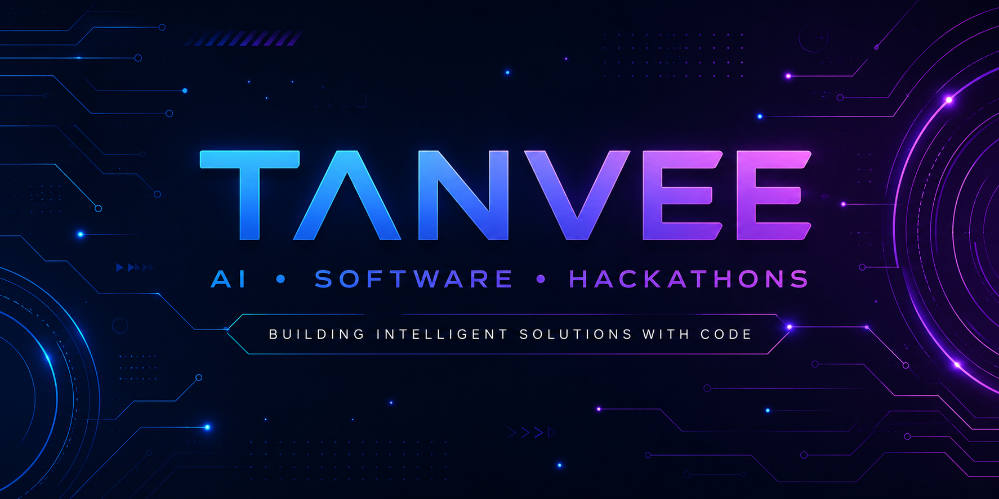

<!-- ===================================================== -->
<!--                TANVEE'S GITHUB PROFILE               -->
<!-- ===================================================== -->

<p align="center">
  
</p>

<div align="center">

# 👋 Hey, I'm Tanvee

### AI • Software Engineering • Hackathons


</div>

---

# 🤖 AI Terminal

```text
> boot Tanvee.exe

██████████████████████████ 100%

Loading Profile...

✔ AI & Future Technologies Student

✔ Software Developer

✔ Java Learner

✔ React Explorer

✔ Python Enthusiast

✔ Azure AZ-900 Certified

✔ Hackathon Builder

----------------------------------------

SYSTEM STATUS

🟢 ONLINE

CURRENT MISSION

Building intelligent solutions with code.

NEXT TARGET

Become an AI Software Engineer 🚀

```

---

# 💫 About Me


### 👩‍💻 Who Am I?

🎓 B.Tech CSE (AI & Future Technologies)

🤖 Passionate about Artificial Intelligence

💻 Love building real-world software

🏆 Active Hackathon Participant

🌱 Currently learning Java, React & AI

🚀 Interested in Open Source

☁ Microsoft Azure AZ-900 Certified

✨ I believe that every project is an opportunity to learn something new.

<br>

---

# ⚡ Current Status

```yaml
Name        : Tanvee

Education   : B.Tech CSE (AI & Future Technologies)

Focus       : AI + Software Development

Learning    : Java | React | Python

Working On  : FinTrack AI

Goal        : Software Engineer

Location    : India 🇮🇳
```

---

# 🛠 Tech Arsenal

<div align="center">


</div>

---

# 🎯 Current Learning Roadmap

```

☕ Java               ████████████░░░░

⚛ React              █████████░░░░░░

🤖 Artificial AI      ███████████░░░░

🐍 Python             █████████████░░

☁ Azure              ██████████░░░░░

```

---

<div align="center">

## ⚡ "Code. Learn. Build. Repeat."

</div>

---
